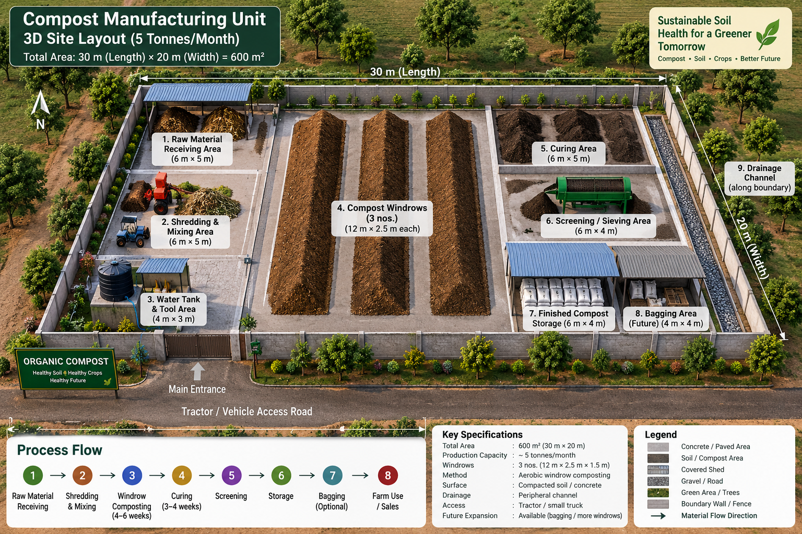

# Compost Pilot Project — Diagrams & Visual Reference
## 10 Tons/Month | Farm near Hyderabad, Telangana

> All dimensions are for the 10 ton/month pilot. North orientation is illustrative — rotate to match your actual site drainage and road access.

---

## Diagram 1 — Master Site Layout (3D Blueprint)

> The image below is the reference site blueprint for this project. It shows the 3D aerial view of the compost manufacturing unit at 5 tonnes/month scale (600 m²), which is the intermediate layout. The 10 ton/month pilot uses the same zone arrangement scaled to ~870 m² — see the ASCII zone table below for the scaled dimensions.



**Image key (zones numbered in the blueprint):**

| Zone No. | Zone Name | Blueprint Size (5T) | Scaled Size (10T pilot) | Floor Type |
|---|---|---|---|---|
| 1 | Raw Material Receiving Area | 6 m × 5 m = 30 m² | 12 m × 6 m = 72 m² | Compacted soil |
| 2 | Shredding & Mixing Area | 6 m × 5 m = 30 m² | 8 m × 6 m = 48 m² | Concrete or compacted |
| 3 | Water Tank & Tool Area | 4 m × 3 m = 12 m² | 6 m × 4 m = 24 m² | Compacted |
| 4 | Compost Windrows (3 nos.) | 12 m × 2.5 m each | 5 m × 2.5 m × 18 windrows | Compacted gravel (5 cm) |
| 5 | Curing Area | 6 m × 5 m = 30 m² | 12 m × 10 m = 120 m² | Compacted soil, shade net |
| 6 | Screening / Sieving Area | 6 m × 4 m = 24 m² | 6 m × 5 m = 30 m² | Concrete slab |
| 7 | Finished Compost Storage | 6 m × 4 m = 24 m² | 10 m × 8 m = 80 m² | Covered, concrete |
| 8 | Bagging Area (Future) | 4 m × 4 m = 16 m² | 6 m × 5 m = 30 m² | Covered |
| 9 | Drainage Channel | Along boundary | Along full perimeter | Concrete channel |
| — | Pathways + buffer | — | ~150 m² | Compacted / gravel |
| — | **Total site** | **600 m² (30×20 m)** | **~870 m²** | |

**Key specifications (from blueprint):**

| Parameter | 5T/Month Blueprint | 10T/Month Pilot |
|---|---|---|
| Total area | 600 m² (30 m × 20 m) | ~870 m² |
| Production capacity | ~5 tonnes/month | ~10 tonnes/month |
| Windrows | 3 nos. (12 m × 2.5 m × 1.5 m) | 18 nos. (5 m × 2.5 m × 1.5 m) in rotation |
| Method | Aerobic windrow composting | Aerobic windrow composting |
| Surface | Compacted soil / concrete | Compacted gravel + concrete at key points |
| Drainage | Peripheral channel | Peripheral channel → soak pit |
| Access | Tractor / small truck | Tractor / small truck |
| Future expansion | Bagging area already planned | Phase 3: windrow turner, full bagging line |

**Process flow (as shown in blueprint):**

```
  ①              ②               ③                ④              ⑤
Raw Material → Shredding  → Windrow       → Curing      → Screening
Receiving       & Mixing     Composting      (3–4 weeks)
                              (4–6 weeks)
                                                              ⑥              ⑦              ⑧
                                                          Storage  →   Bagging    →  Farm Use
                                                                        (Optional)    / Sales
```

---

## Diagram 2 — Single Windrow Cross-Section Profile

```
                TOP WIDTH  0.8 m
               ┌───────────┐
              /             \
             /  H = 1.5 m   \
            /                 \
           /                   \
          /                     \
         /                       \
        └───────────────────────────┘
               BASE WIDTH  2.5 m

   ← ─ ─ ─ ─ LENGTH: 5.0 m ─ ─ ─ ─ →

   Layer stack (bottom to top):
   ━━━━━━━━━━━━━━━━━━━━━━━━━━━━━━━━━━━━  ← Layer 6: Thin soil/cured compost (2–3 cm) — top seal
   ▒▒▒▒▒▒▒▒▒▒▒▒▒▒▒▒▒▒▒▒▒▒▒▒▒▒▒▒▒▒▒▒▒▒▒  ← Layer 5: Green (cow dung / poultry litter, 10 cm)
   ░░░░░░░░░░░░░░░░░░░░░░░░░░░░░░░░░░░░  ← Layer 4: Brown (shredded straw/leaves, 15 cm)
   ▒▒▒▒▒▒▒▒▒▒▒▒▒▒▒▒▒▒▒▒▒▒▒▒▒▒▒▒▒▒▒▒▒▒▒  ← Layer 3: Green (cow dung + neem cake, 10 cm)
   ░░░░░░░░░░░░░░░░░░░░░░░░░░░░░░░░░░░░  ← Layer 2: Brown (shredded straw, 20 cm)
   ▓▓▓▓▓▓▓▓▓▓▓▓▓▓▓▓▓▓▓▓▓▓▓▓▓▓▓▓▓▓▓▓▓▓▓  ← Layer 1: Coarse stalks/cane trash (10 cm) — aeration base
   ═══════════════════════════════════  ← Gravel floor (5 cm)

   Legend:
   ▒ = Green material (N-rich, wet: cow dung, poultry litter, press mud)
   ░ = Brown material (C-rich, dry: straw, leaves, groundnut shells)
   ▓ = Coarse base (big stalks, cane trash — creates air channels)
   ━ = Top cover (soil, cured compost — retains heat, blocks flies)
```

**Single windrow numbers:**

| Measurement | Value |
|---|---|
| Base width | 2.5 m |
| Top width | ~0.8 m |
| Height | 1.5 m |
| Length | 5.0 m |
| Volume | ~11.2 m³ |
| Input mass | ~4,200 kg (wet) |
| Footprint (incl. 0.5 m access) | ~17.5 m² |
| Output (finished compost) | ~1,180–1,250 kg |

---

## Diagram 3 — Process Flow (End-to-End)

```
  ┌────────────────────────────────────────────────────────────────────────┐
  │                    RAW MATERIAL INPUTS                                 │
  │  Cow dung  │  Paddy straw  │  Neem cake  │  Poultry litter  │  Leaves │
  └─────────────────────────────┬──────────────────────────────────────────┘
                                 │
                                 ▼
                    ┌────────────────────────┐
                    │  RECEIVING & WEIGHING  │   ← Log weight in register
                    │  Zone A                │   ← Sort greens vs. browns
                    └────────────┬───────────┘
                                 │
              ┌──────────────────┼──────────────────┐
              ▼                                     ▼
   ┌─────────────────────┐              ┌─────────────────────┐
   │  SHREDDING          │              │  PRE-SOAKING        │
   │  Zone B             │              │  Zone B (soak pit)  │
   │  Target: 5–8 cm     │              │  Straw soaked 12–   │
   │  particle size      │              │  24 hrs in dung     │
   └──────────┬──────────┘              │  slurry / water     │
              │                         └──────────┬──────────┘
              └──────────────────┬─────────────────┘
                                 │
                                 ▼
              ┌─────────────────────────────────┐
              │  WINDROW CONSTRUCTION           │
              │  Zone C (Active Zone A)         │
              │  Layer browns + greens          │
              │  Set moisture 50–60%            │
              │  Insert temp probe marker       │
              │  Tag with: Date + Batch No.     │
              └─────────────────┬───────────────┘
                                │
                                ▼
              ┌─────────────────────────────────┐
              │  ACTIVE DECOMPOSITION           │
              │  Zone C — Weeks 1–8             │
              │                                 │
              │  Week 2: Turn 1 → 55–65°C       │
              │  Week 3: Turn 2 → 55–60°C       │
              │  Week 4: Turn 3 → 50–55°C       │
              │  Week 5–6: Turn 4–5 → 45–50°C  │
              │  Week 7–8: Turn 6 → 40–45°C    │
              │                                 │
              │  Monitor: Temp + Moisture       │
              │  daily (Mon–Sat)                │
              └─────────────────┬───────────────┘
                                │
                          ┌─────┴──────┐
                          │ Mature?    │
                          │ Temp ≤ 40°C│
                          │ Earthy     │
                          │ smell?     │
                          └─────┬──────┘
                    NO ◄────────┤──────────► YES
                    ↓           │            ↓
              Turn again        │     ┌──────────────────────┐
              wait 1 week       │     │  CURING ZONE (D)     │
                                │     │  Weeks 9–11          │
                                │     │  Low pile (0.8 m)    │
                                │     │  1–2 light turns     │
                                │     │  Bag/seal test       │
                                │     └──────────┬───────────┘
                                │                │
                                │         ┌──────┴──────┐
                                │         │  Mature?    │
                                │         │  Smell test │
                                │         │  Germ test  │
                                │         └──────┬──────┘
                                │   NO ◄─────────┤──────────► YES
                                │   ↓            │            ↓
                                │  Cure          │    ┌───────────────────┐
                                │  1 more week   │    │  SCREENING        │
                                │                │    │  Zone E           │
                                │                │    │  6–8 mm sieve     │
                                │                │    │  Rejects → back   │
                                │                │    │  to next batch    │
                                │                │    └────────┬──────────┘
                                │                │             │
                                │                │             ▼
                                │                │    ┌───────────────────┐
                                │                │    │  STORAGE          │
                                │                │    │  Zone F (covered) │
                                │                │    │  Moisture ≤ 40%   │
                                │                │    │  Max 6 months     │
                                │                │    └────────┬──────────┘
                                │                │             │
                                │                │    ┌────────┴──────────┐
                                │                │    │  DISPATCH         │
                                │                │    │  Bulk / Bagged    │
                                │                │    │  Weigh + invoice  │
                                │                │    └───────────────────┘
                                │                │
                                │     ┌──────────┴───────────┐
                                │     │  LEACHATE            │
                                │     │  Collection channel  │
                                │     │  → soak pit OR       │
                                │     │  dilute 1:10 →       │
                                │     │  liquid fertilizer   │
                                │     └──────────────────────┘
```

---

## Diagram 4 — Batch Rotation Calendar (Rolling 12-Week View)

> One row = one windrow. Read across weeks to see its lifecycle stage.
> New windrow starts every 3 days. Shown here weekly for clarity.

```
Windrow  │ Wk1 │ Wk2 │ Wk3 │ Wk4 │ Wk5 │ Wk6 │ Wk7 │ Wk8 │ Wk9 │W10 │W11 │W12 │
─────────┼─────┼─────┼─────┼─────┼─────┼─────┼─────┼─────┼─────┼────┼────┼────┤
 W-01    │ NEW │ HOT │ HOT │ ACT │ ACT │ MAT │ MAT │ CUR │ CUR │ SCR│ STR│    │
 W-02    │     │ NEW │ HOT │ HOT │ ACT │ ACT │ MAT │ MAT │ CUR │ CUR│ SCR│ STR│
 W-03    │     │     │ NEW │ HOT │ HOT │ ACT │ ACT │ MAT │ MAT │ CUR│ CUR│ SCR│
 W-04    │     │     │     │ NEW │ HOT │ HOT │ ACT │ ACT │ MAT │ MAT│ CUR│ CUR│
 W-05    │     │     │     │     │ NEW │ HOT │ HOT │ ACT │ ACT │ MAT│ MAT│ CUR│
 W-06    │     │     │     │     │     │ NEW │ HOT │ HOT │ ACT │ ACT│ MAT│ MAT│
 W-07    │     │     │     │     │     │     │ NEW │ HOT │ HOT │ ACT│ ACT│ MAT│
 W-08    │     │     │     │     │     │     │     │ NEW │ HOT │ HOT│ ACT│ ACT│
─────────┴─────┴─────┴─────┴─────┴─────┴─────┴─────┴─────┴─────┴────┴────┴────┘

Stage Legend:
  NEW = Windrow constructed this week (input 4,200 kg, moisture set 55%)
  HOT = Peak heating phase, 55–65°C, turn every 5–7 days
  ACT = Active but cooling, 45–55°C, turn weekly
  MAT = Maturing, 35–45°C, temperature falling, turn once
  CUR = Curing zone, ≤35°C, check smell + germination
  SCR = Screening (6–8 mm sieve)
  STR = In covered storage, ready for dispatch
```

**Reading this calendar:**
- By Week 5 you have 5 windrows active simultaneously
- From Week 8 onwards, **1 windrow completes screening every week** → ~1,180 kg output/week → ~4,700 kg/month
- By Week 11–12 at full rotation: **~9,500–10,500 kg/month** at steady state
- First saleable product is available around **Week 11 from Day 1**

---

## Diagram 5 — Water & Drainage Layout

```
                        BOREWELL / WATER SOURCE
                               │
                     ┌─────────┴──────────┐
                     │  1,000 L TANK      │
                     │  + 0.5 HP pump     │
                     └─────────┬──────────┘
                               │ supply line (HDPE 25mm)
              ┌────────────────┼──────────────────┐
              │                │                  │
              ▼                ▼                  ▼
       Shredding           Active zone        Curing zone
       pre-soak pit        (watering          (occasional)
       (fill daily)        hose points
                           every 5 m)

                    DRAINAGE FLOW (gravity)
                    ┌─────────────────────────────────────┐
                    │ Perimeter drain channel              │
                    │ (30 cm wide × 30 cm deep, concrete) │
                    │ Slope: 1 cm per 3 m toward soak pit │
                    └─────────────────┬───────────────────┘
                                      │
                                      ▼
                    ┌─────────────────────────────────────┐
                    │  LEACHATE SOAK PIT                  │
                    │  2.0 m × 2.0 m × 1.5 m deep        │
                    │  Lined with bricks, filled gravel   │
                    │                                     │
                    │  Option A: Let soak into ground     │
                    │  Option B: Pump out → dilute 1:10   │
                    │            with water → spray on    │
                    │            crops as liquid feed     │
                    └─────────────────────────────────────┘

Water consumption estimate:
  Active pile watering:  ~150 L/windrow/week × 14 windrows = 2,100 L/week
  Shredding/pre-soak:    ~500 L/week
  General site cleanup:  ~200 L/week
  ─────────────────────────────────────────────────────────
  Total:                 ~2,800 L/week → ~400 L/day
```

---

## Diagram 6 — Equipment Layout in Shredding Zone (Zone B)

```
  ┌──────────────────────────────────────────────────────┐
  │                SHREDDING ZONE (8 m × 6 m)           │
  │                                                      │
  │  ┌──────────────┐    ┌────────────────────────────┐  │
  │  │  RAW STRAW   │    │  ELECTRIC SHREDDER (3 HP)  │  │
  │  │  STACK       │───►│  • 5–8 cm output size      │  │
  │  │  (temp hold) │    │  • Feed rate: ~200 kg/hr   │  │
  │  └──────────────┘    └──────────────┬─────────────┘  │
  │                                     │ shredded output│
  │  ┌──────────────┐                   ▼                │
  │  │  PRE-SOAK    │    ┌────────────────────────────┐  │
  │  │  PIT         │    │  SHREDDED MATERIAL PILE    │  │
  │  │  2m×2m×0.8m  │    │  (waiting to be mixed)     │  │
  │  │  (straw+dung │    └────────────────────────────┘  │
  │  │   slurry)    │                   │                 │
  │  └──────────────┘                   │                 │
  │                                     ▼                 │
  │           ┌─────────────────────────────────────┐    │
  │           │  MIXING/LOADING AREA                │    │
  │           │  Combine shredded browns + wet      │    │
  │           │  greens (dung, litter, press mud)   │    │
  │           │  Wheelbarrow/tractor loader to      │    │
  │           │  carry mix to windrow zone          │    │
  │           └─────────────────────────────────────┘    │
  └──────────────────────────────────────────────────────┘

  Shredder daily usage:
  Need: 1,400 kg/day raw input → ~700 kg is shreddable dry matter
  At 200 kg/hr → 3.5 hrs of shredding per day
  Operator: 1 person, morning shift
```

---

## Diagram 7 — Monthly Material Flow Sankey (Simplified)

```
INPUT (36,600 kg raw)
│
├── Cow dung (10,980 kg) ──────────────────────────────────┐
├── Paddy straw (15,372 kg) ─────────────────────────────┐ │
├── Leaf litter (5,124 kg) ────────────────────────────┐ │ │
├── Neem cake (2,928 kg) ──────────────────────────┐   │ │ │
└── Poultry litter + press mud (2,196 kg) ──────┐  │   │ │ │
                                                │  │   │ │ │
                                                ▼  ▼   ▼ ▼ ▼
                                          ┌───────────────────┐
                                          │   COMPOSTING      │
                                          │   PROCESS         │
                                          └─────────┬─────────┘
                                                    │
              ┌─────────────────────────────────────┼─────────────────┐
              │                                     │                 │
              ▼                                     ▼                 ▼
   LOSSES (moisture + CO₂)            SCREENING REJECTS        FINISHED COMPOST
   ~22,300 kg (61%)                   ~3,300 kg (9%)           ~11,000 kg (30%)
   (evaporation during                (returns to next          (~10,000 kg
    decomposition)                     batch)                    after moisture
                                                                  adjustment)
                                                                      │
                              ┌───────────────────────────────────────┤
                              │                   │                   │
                              ▼                   ▼                   ▼
                    BULK SALES               BAGGED SALES        OWN FARM USE
                    4,000 kg                 4,000 kg            2,000 kg
                    @ ₹5/kg                  @ ₹8–14/kg          (saves ₹20K
                    = ₹20,000                = ₹32,000–56,000      fertilizer)
```

---

## Diagram 8 — Year-1 Ramp-Up Timeline

```
MONTH    │ 1    │ 2    │ 3    │ 4    │ 5    │ 6    │ 7    │ 8    │ 9    │10–12
─────────┼──────┼──────┼──────┼──────┼──────┼──────┼──────┼──────┼──────┼──────
ACTIVITY │ Site │ Site │Build │Ramp  │Ramp  │Full  │Full  │Full  │Full  │Scale
         │ prep │ prep │ W#1–4│ up   │ up   │ ops  │ ops  │ ops  │ ops  │ /sell
─────────┼──────┼──────┼──────┼──────┼──────┼──────┼──────┼──────┼──────┼──────
WINDROWS │  —   │  —   │  4   │  8   │ 12   │ 18   │ 18   │ 18   │ 18   │ 18+
BUILT    │      │      │      │      │      │      │      │      │      │
─────────┼──────┼──────┼──────┼──────┼──────┼──────┼──────┼──────┼──────┼──────
OUTPUT   │  0   │  0   │  0   │  5 T │  8 T │ 10 T │ 10 T │ 10 T │ 10 T │12–15T
(tons)   │      │      │      │      │      │      │      │      │      │
─────────┼──────┼──────┼──────┼──────┼──────┼──────┼──────┼──────┼──────┼──────
REVENUE  │  0   │  0   │  0   │ 40K  │ 60K  │ 80K  │ 80K  │ 80K  │ 90K  │100K+
(₹)      │      │      │      │      │      │      │      │      │      │
─────────┼──────┼──────┼──────┼──────┼──────┼──────┼──────┼──────┼──────┼──────
OPEX (₹) │ 40K  │ 40K  │ 80K  │110K  │120K  │128K  │128K  │128K  │128K  │130K
─────────┼──────┼──────┼──────┼──────┼──────┼──────┼──────┼──────┼──────┼──────
NET (₹)  │-40K  │-40K  │-80K  │-70K  │-60K  │-48K  │-48K  │-48K  │-38K  │~±0
─────────┴──────┴──────┴──────┴──────┴──────┴──────┴──────┴──────┴──────┴──────
                                                                 ▲
                                              Break-even zone ───┘  (Month 10–12
                                              with own-farm savings + retail sales)
```

---

*Document version: 1.0 | Companion to README.md and RUNBOOK.md*
*All diagrams use fixed-width ASCII — render best in monospace font (VS Code editor, terminal, or printed PDF)*
