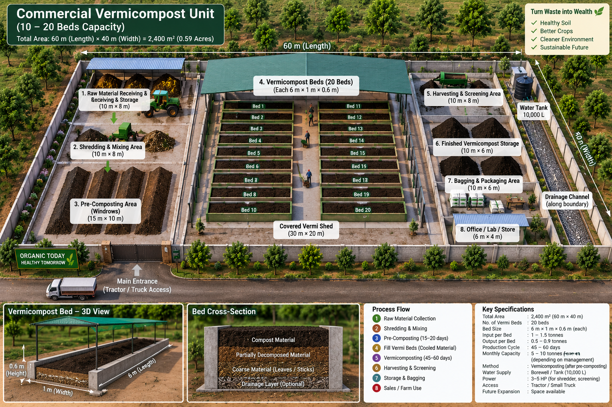

# Vermicompost Plan
**Commercial Unit — 20 Beds | Farm near Hyderabad, Telangana**

> "Turn Waste into Wealth — Healthy Soil, Better Crops, Cleaner Environment"
> Run this alongside your compost operation. Same land, same suppliers, same customers — higher price product.

---

## What Files Are Here

| File | What It Covers |
|---|---|
| **README.md** (this file) | Overview, what vermicompost is, how it works with your compost business |
| **SETUP.md** | Site layout, bed construction, equipment, setup costs |
| **OPERATIONS.md** | Daily feeding, harvesting, checklists, troubleshooting |
| **BUSINESS-PLAN.md** | Products, pricing, customers, financials, 3-year plan |

---

## What Is Vermicompost?

Vermicompost is made by **earthworms**, not heat.

You feed organic waste to worms. Worms eat it, digest it, and pass it out as **worm castings** — one of the richest natural fertilisers available.

---

## Compost vs Vermicompost — Simple Comparison

| | **Compost** | **Vermicompost** |
|---|---|---|
| Made by | Microbes + heat | Earthworms |
| Temperature | 55–65°C (hot pile) | 20–30°C (cool beds) |
| Time to finish | 10–12 weeks | 45–60 days |
| Worms needed | No | Yes |
| NPK content | 1.5–2.5% N, 0.5–1.5% P | 2–3% N, 1.5–2% P (higher) |
| Texture | Crumbly, slightly coarse | Very fine, like coffee grounds |
| Smell | Earthy | Almost none |
| Selling price | ₹5–15/kg | ₹20–35/kg |
| Best for | Large-scale field use | High-value crops, nurseries, urban buyers |

---

## Your Commercial Unit — Key Numbers

From the blueprint:

| Item | Value |
|---|---|
| Total site area | 60m × 40m = **2,400 m² (0.59 acres)** |
| Number of vermi beds | **20 beds** |
| Each bed size | **6m × 1m × 0.6m** |
| Input per bed per cycle | 1–1.5 tonnes |
| Output per bed per cycle | **0.5–0.9 tonnes** |
| Production cycle | **45–60 days** |
| Monthly output (all 20 beds) | **5–10 tonnes/month** |
| Water supply | Borewell / tank (10,000 L) |
| Power needed | 3–5 HP (shredder + screener) |
| Access | Tractor / small truck |

---

## Site Blueprint



---

## 8 Zones in the Unit

| Zone | Name | Size | Purpose |
|---|---|---|---|
| 1 | Raw Material Receiving & Storage | 10m × 8m | Unload, sort, weigh materials |
| 2 | Shredding & Mixing | 10m × 8m | Shred to 5–8 cm, mix greens + browns |
| 3 | Pre-Composting (Windrows) | 15m × 10m | Pre-compost 15–20 days to cool material before worms |
| 4 | Vermi Beds (Covered Shed) | 30m × 20m | 20 worm beds — main production area |
| 5 | Harvesting & Screening | 10m × 8m | Sieve finished vermicompost (3–5 mm mesh) |
| 6 | Finished Compost Storage | 10m × 6m | Store bagged product dry |
| 7 | Bagging & Packaging | 10m × 6m | Weigh, bag, label, dispatch |
| 8 | Office / Lab / Store | 6m × 4m | Records, pH meter, tools |

---

## The 8-Step Process (Simple View)

```
① Collect raw materials (cow dung, crop waste, kitchen scraps)
         ↓
② Shred and mix (5–8 cm pieces, 60% green + 40% brown)
         ↓
③ Pre-compost in windrows — 15–20 days (MUST cool below 30°C)
         ↓
④ Fill vermi beds with cooled material, add worms
         ↓
⑤ Worms eat and digest — 45–60 days (feed every 3–4 days)
         ↓
⑥ Harvest and screen (3–5 mm sieve)
         ↓
⑦ Store dry, bag and label
         ↓
⑧ Sell to customers or use on your own farm
```

---

## Why Add Vermicompost to Your Compost Business?

| Reason | Detail |
|---|---|
| **3× higher price** | ₹20–35/kg vs ₹5–15/kg for regular compost |
| **Same raw materials** | Cow dung, crop residues — already in your supply chain |
| **Same customers** | Nurseries and organic farmers already want it |
| **Faster cycle** | 45–60 days vs 10–12 weeks for compost |
| **Zero waste** | Compost screening rejects go directly into worm beds |
| **Free extra product** | Worm tea (liquid fertiliser) drains from beds at no extra cost |
| **Worm sales** | Once population grows, sell starter worms to other farmers |

---

## How Both Work Together on Your Farm

```
RAW MATERIALS (cow dung, crop waste, kitchen scraps)
                    │
         ┌──────────┴──────────┐
         │                     │
    COMPOST UNIT           VERMI UNIT
    (windrows)             (20 worm beds)
    10–12 weeks            45–60 days
    ₹5–15/kg               ₹20–35/kg
         │                     │
         └──────────┬──────────┘
                    │
         SAME CUSTOMERS + MARKET
     (farmers, nurseries, urban buyers)

  Compost screening rejects → worm beds (zero waste)
  Worm tea → bottled as liquid fertiliser
```

---

## Starting Plan — When to Begin

| Phase | When | Beds | Output | Investment |
|---|---|---|---|---|
| Trial | Month 6–8 of compost ops | 2 beds | 100–150 kg/month | ~₹20,000 |
| Small commercial | Month 12 | 10 beds | 500 kg/month | ~₹1L |
| Full 20-bed unit | Month 18–24 | 20 beds | 5–10 tonnes/month | ~₹4.4L |

> **Rule:** Start vermicompost only after your compost operation is stable. Don't split focus in Year 1.

---

## Combined Farm Income (Year 3 Target)

| Product | Monthly Output | Monthly Revenue |
|---|---|---|
| Compost (10–15 T) | 10–15 tonnes | ₹80,000–1,00,000 |
| Vermicompost (5–10 T) | 5–10 tonnes | ₹1,00,000–2,50,000 |
| Worm tea | 150+ L | ₹10,000–15,000 |
| Live worms | 10+ kg | ₹4,000–6,000 |
| **Total farm revenue** | | **₹1,94,000–3,71,000/month** |

---

## Quick Health Reminders

✅ Pre-compost all material 15–20 days before adding to worm beds
✅ Temperature in beds must stay below 35°C at all times
✅ Covered shed is mandatory — direct sun kills worms
✅ Never feed fresh cow dung directly to worms
✅ Check moisture every morning — 60–70% is correct
✅ Worm tea must be diluted 1:5 to 1:20 before use on plants

---

## Read Next

1. **SETUP.md** — how to build the 20-bed unit, zone by zone
2. **OPERATIONS.md** — how to run it day to day, feed, harvest, troubleshoot
3. **BUSINESS-PLAN.md** — how to price, sell, and grow the business

---

*Version 2.0 — Updated from commercial blueprint (60m × 40m, 20 beds, 2,400 m²)*
*Run alongside: `../compost/` folder for the regular compost operation*
